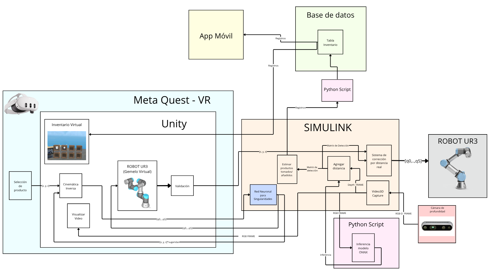

# Proyecto Final UR3 - Gemelo Digital y Realidad Mixta

Proyecto para controlar un robot UR3 mediante un gemelo digital visualizado en realidad mixta.

## Tecnologías principales

- Universal Robots UR3
- Meta Quest 3
- Unity
- OpenXR
- Simulink
- MoveIt 2
- Raspberry Pi
- ESP32
- Cámara RGB-D
- MQTT

## Objetivo

Seleccionar posiciones o productos dentro de un almacén virtual, validar trayectorias en el gemelo digital y posteriormente ejecutar los movimientos en el robot UR3 físico.

## Arquitectura del Proyecto
Diagrama general de la arquitectura del sistema, mostrando la comunicación entre Meta Quest, Unity, Simulink, el robot UR3 y el sistema de inventario.

